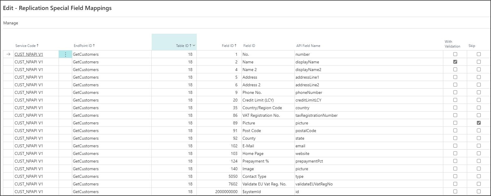

# Configure Replication Module

This topic describes the process of configuring the Replication Setup. As soon as you complete the necessary setup, data will be synchronized automatically in the current company from the company stated in the **Source Company** field.

## Setup in the Source (Master) companies

1. Open the **Replication Setup (Source Company)** page.
2. Press **Enable Replication Counter**. This is disabled by default to reduce overhead for companies which are not used as a Source for the data replication process.

## Setup in the Target (Store) companies

1. Open the **Replication API Setup List** page.  
   Multiple predefined setups are created automatically and grouped according to the master data, for example customer-related data, vendor-related data, and so on.
2. Open the first **CUST_NPAPI V1** setup.
3. Enter the necessary information in order to enable the setup (the setup is disabled by default).
 > [!IMPORTANT]
 > If the replication is made from an external database, state the correct external URL in the **Service Base URL** field and enable the **External Database** toggle switch.           
 
4. Press the ellipsis button next to the **Source Company Name** field and select the company from which you want to import data.   
   If the **External Company** is disabled, you can select a company from the current database, otherwise the system makes a web API request to the external database to retrieve companies and you can select a company from that database.
5. The **Source Company Id** is automatically populated.       
   This field is used by the system when it makes API requests to retrieve data from the selected company.
6. Enter the **Source Company Tenant** if you work in a multitenant environment.
7. Select the authorization type and the necessary credentials, then enable the authorization if needed.
8. (Optional) Enter an email address in the field **Error Notification Email Address**.       
   This will make the system send a predefined email to that address if any errors occur during the data replication process. 
9. Click **Test Connection** to see if the connection can be established.
10. Click **Enable** if the connection was successful.     
    After confirmation, the Replication Setup is enabled and all data in the **Source Company** will be imported into the current company.
> [!Note]  	
> When enabling the Replication Setup, a Naviconnect Import Type and a Job Queue Entry are created in the background, so the import is done automatically based on setup of these records.

## Next steps

After you're done configuring the **General** Replication Setup options, you can also configure the **Endpoints** and **Special Field Mappings**.

### Configure Endpoints

The import is done based on the **Endpoints** subpage setup. If necessary, you can configure it.

It is possible to:
- disable specific endpoints (which will stop importing data for those tables).
- change the order in which tables are imported.
- update the **Replication Counter** field manually.
- update the **Replication Counter** field automatically by using action **Get Last Replication Counter**. When you use this, the system makes a web request to retrieve the Last Replication Counter from the source database table. This should be used if the starting point of the replication needs to be changed.
- add a **Fixed Filter** which will be added to the URL when sending the request. You can use this option if only some of the records need to be replicated and not the whole table. Example: *number gt '10003' and number lt '10008'*. [See more](https://docs.microsoft.com/en-us/dynamics-nav/using-filter-expressions-in-odata-uris).
- add new endpoint configuration.

### Configure Special Field Mappings

In general, the fields for each table (endpoint) are mapped automatically. In the API page used as a webservice, most fields are named like the table fields in the CamelCase.    

**Example:**   
**Customer Posting Group** --> **customerPostingGroup**

However, there are special cases when the field names are different. You can use the **Special Fields Mappings** page to map these. This page is accessed by clicking the **Manage** button, followed by the **Special Field Mappings** button in the **Endpoints** panel. 

**Example:**

### Check Missing Fields

You can check if there are table fields that are not handled by the Data Replication by running report **Check Missing Fields**.

This report uses web requests to compare the metadata of the Business Central APIs with the fields from the actual tables. Then, it displays in a layout any fields that are not handled by the API, hence they are missed by the data replication process.

### Related links
- [**Replication module introduction**](../intro.md)

