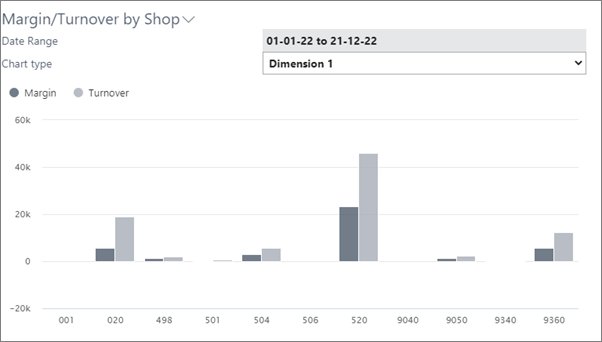

# Chart margin/turnover by shop

The **NP Retail Manager** Role Center has a chart with which you can create an overview of the sales per each shop. If a business has different shops, you can use Global Dimensions to perform the analysis.    

You can analyze the margin and turnover of each shop on a daily, weekly, monthly, quarterly, or yearly basis. To achieve such dashboard, several basic configurations need to be performed. 

### Related links

- [Set up Global Dimensions](../howto/set_up_global_dimensions.md)