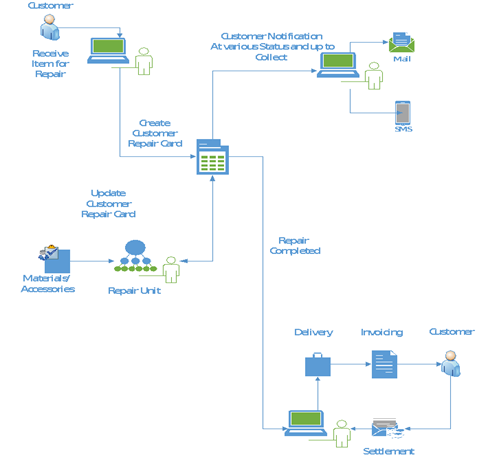

# Service module for repairs

This module manages the item repair process which is initiated when a customer brings an item to the shop for repairs. 

### Highlighted articles:

- [Customer repair flow](explanation/customer_repair_flow.md)
- [Set up service module for repairs](howto/set_up_customer_repair.md)