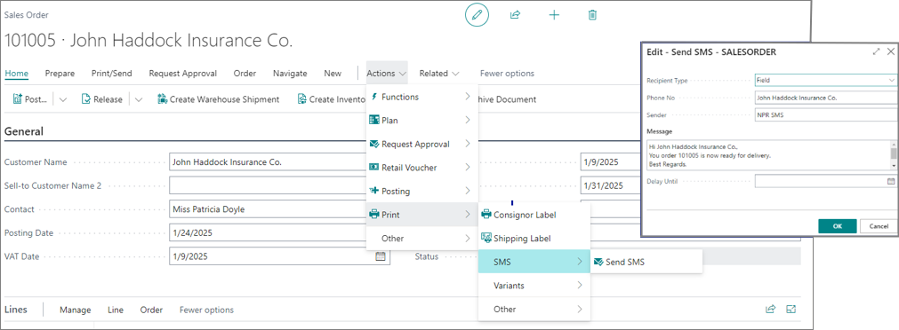

# SMS Module

SMS module provides an option to send information via SMS from the NP Retail solution, such as customer-related information (contact and documents from the **Customer Card**) and transactions from the POS entry.

You can set up the SMS module for the following master cards, documents, and modules:

- **Customer Card**
- **Retail Voucher Card**
- **POS Entry List**
- Click & Collect module
- Customer Repair module
- E-ticketing module
- Wallet module
- Documents like sales orders, posted invoices, and store orders.

    

The initial setup needs to be performed on the [SMS Setup](./howto/smshowto.md) page.

### Related links

- [Configure the SMS Setup](./howto/smshowto.md)
- [SMS setup (reference guide)](./reference/sms_module_reference.md)
- [SMS template (reference guide)](./reference/sms_template_reference.md)
