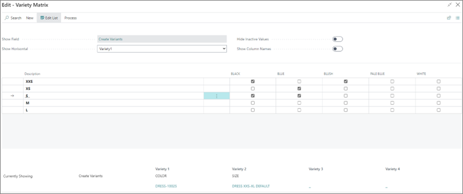

# Assign a variety to an item

After you've set up varieties, you can assign them to items. To assign a variety to an item, follow the provided steps:

1. Click the  button, enter **Items** and open the related link.   
2. Open the **Item Card** of an item you wish to assign the variety to. 
3. Select the **Variety Group** in the **Variety** section.     
   All other fields are populated automatically with the data from the variety group you add.
   The varieties are now assigned to the item, but it's also necessary to assign the values of varieties which this item has. 
4. Click **History** in the ribbon, followed by **Variety Maintenance**.     
   The matrix with different values is opened as a result. 
5. Tick the checkboxes in the matrix to create combinations of values that the item is going to have.       
   In the provided example, the item `10025 - dress` has the following combinations of size and color: `XXS Black`, `XXS Blush`, `S Black`, `S Blue`, and `XS Blue`.   

   

### Related links

- [Create a variety](create_variety.md)
- [Variety setup (reference table)](../reference/variety_setup.md)
- [Variety (reference guide)](../reference/variety.md)
- [Variety table (reference guide)](../reference/variety_table.md)