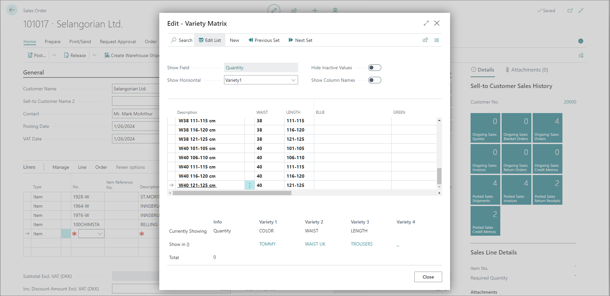

# Set up variety matrix facilities on Sales Orders

To set up variety matrix facilities on sales and purchase orders, follow the provided steps: 

1. Click the  button, enter **Variety Setup** and open the related link.   
2. Enable **Pop up Variety Matrix**.     
   Now, if an item with variants is selected on sales and purchase documents, the variety matrix will pop up. 
    
    > [!Note]
    > In normal circumstances, the user will insert a line, item code, then select the required variant code, and continue to set the quantity. Therefore, for each variety, it will be necessary to insert an item and variant code manually. 

3. Create a new **Sales Order** or edit an existing one in the **Open** status.
4. In the **Lines** section add an item which has variants available.     
   The **Variety Matrix** popup window is displayed.     

   

5. Insert the quantity to be sold.      
   Based on the matrix, the required lines will be automatically inserted. 

## Next steps

### Set up variety matrix facilities on Sales Return Orders, Purchase Orders, and Return Purchase Orders

The same procedure should be followed to enable the **Variety Matrix** popup window on **Sales Return Orders**, **Purchase Orders**, and **Return Purchase Orders**. The only difference being that you need to start from one of those respective administrative sections. 

### Related links

- [Create varieties in Business Central](create_variety.md)
- [Assign a variety to an item](assign_variety_to_item.md)
- [Variety setup (reference guide)](../reference/variety_setup.md)