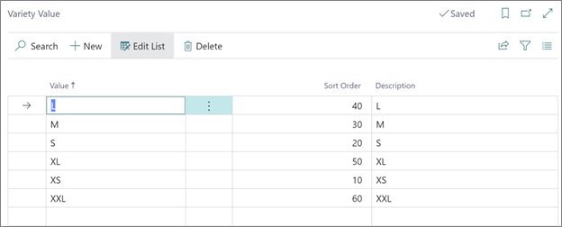

# Variety values (reference guide)

The following options are available when assigning values to varieties in the **Variety Value** administrative section:

| Field Name      | Description |
| ----------- | ----------- |
| **Value**       | The value of the variety.     |
| **Description**   | Specifies additional information about a variety value.   |
| **Sort Order**  | Specifies the order in which the values are displayed in the matrix.  |

### Related links

- [Variety setup (reference guide)](variety_setup.md)
- [Variety (reference guide)](variety.md)
- [Variety table (reference guide)](variety_table.md)