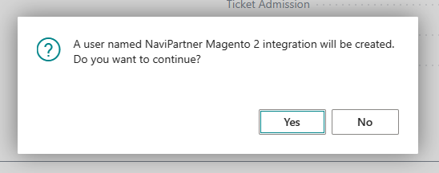

# Create Azure Active Directory Application

To interact with the web services (APIs) of Business Central, the external party needs to use the OAuth 2 protocol to gain an access token. When working with two services interacting with each other, the client needs to use the client credentials flow.

The credentials for the client credentials flow is obtained through an Azure Active Directory application. To create one along with the set of credentials, follow the provided steps:

> [!Note]
> Make sure the actions are performed by a user that is both an Azure Active Directory administrator and Business Central administrator.
> These steps require you to grant administrator access to certain parts of your Azure Active Directory. You should therefore be an administrator in your tenant or get your administrator to perform these steps.

> [!Note]
> This procedure can only be used when your Business Central tenant is registered with Azure Active Directory as the login method. If you are using Microsoft's SaaS offering this will already be the case.

### Procedure

1. Click the  button, enter **Magento Setup**, and select the related link.      

2. In the ribbon select **Actions** > **Magento Integration** > **Azure Active Directory OAuth** and click the **Create Azure AD App** action.

3. In the pop-up window grant permission to the "NP Retail - Azure AD Application Management App". This application is what allows the code to create the Azure Active Directory application for us in the Magento integration.

    > [!Warning]
    > Make sure that the consent screen identifies the application as being verified with "Navi Partner København ApS" as Microsoft Partner.

4. When asked if you want to create a user, click **Yes**.

    

5. When the Azure Active Directory application is created the information will be shown on the screen.

    > [!Note]
    > The client secret that is shown in the message box is not visible after the box is closed. Make sure to copy it to a safe place.

    > [!Warning]
    > Using the credentials shown on the screen an external party is able to access certain parts of your Business Central tenant. Make sure to only share them with appropriate parties and do so in a secure way.

6. Click the  button, enter **Azure Active Directory Applications**, and select the related link.

7. Find the application created by the last step and open the card by clicking the **Client ID**.

8. On the Azure Active Directory Application Card, click **Grant Consent** to allow the newly created access to the Business Central API.