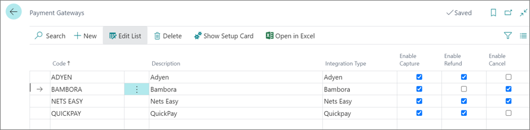
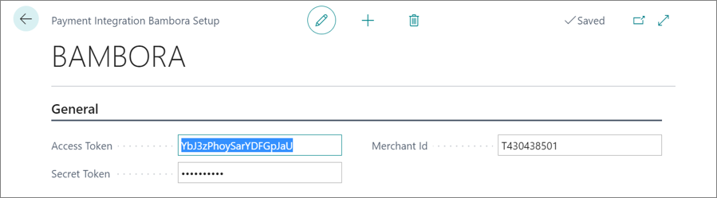
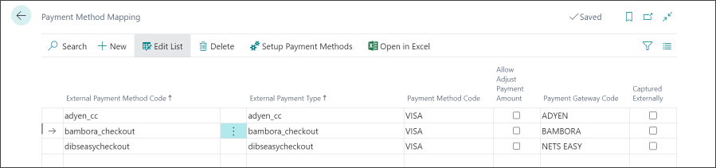

# Set up Bambora payment integration

To set up the Bambora payment integration in NP Retail, make sure the prerequisites are met, and follow the provided steps:

### Prerequisites

1. Get a Bambora merchant.

    Before you can get the required information to integrate Business Central and Bambora,
    you need to have a [merchant account created with Bambora](https://developer.bambora.com/europe/checkout/getting-started/create-account).

2. Acquire the API key information.

    Business Central uses the [Bambora Transaction API](https://developer.bambora.com/europe/checkout/api-reference/transaction)
    to interact with Bambora. In order for Business Central to capture, refund, or cancel a transaction, it needs access to the API.

    Follow [Bambora's guide](https://developer.bambora.com/europe/checkout/getting-started/access-api#get-access-to-the-api) to get the access credentials.
    Business Central will need the following information: **Access token**, **Merchant ID**, and **Secret token**.

    > [!Note]
    > NaviPartner advises that you give the key an appropriate name, for example "Business Central". This will help you differentiate the keys afterwards.

### Procedure

1. Click the  button, enter **Payment Gateways**, and select the related link.      
 
2. Click **New** to create a code for Bambora integration.    

    

3. Click **Show Setup Card** to edit details.  
   The following values are required, and need to contain the appropriate values:     
   - **Access Token** - API username
   - **Secret Token** - API password
   - **Merchant ID** - The letter T stands for test account, while the letter P stands for the production account.    

    

4. Click the  button, enter **Payment Method Mapping**, and select the related link or navigate to **Magento Setup**, and click **Set up payment methods**.     
   Assigning the payment gateway to the specific payment method mappings needs to be done before the payment gateway can be successfully used. 
5. Create a new payment method code for each new line, e.g. bambora_checkout. 
6. Provide a **Description**.
7. Provide a **Payment Method Code**, e.g. Visa.     
   If the payment method code doesn't exist, you need to create it, and assign it to the line.
8. Assign each **External Payment Method Code** to the **Payment Gateway Code**.        
   
   

### Related links

- [Payment Gateways](../paymentgateway.md)