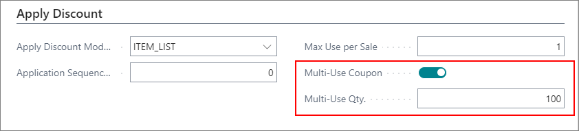
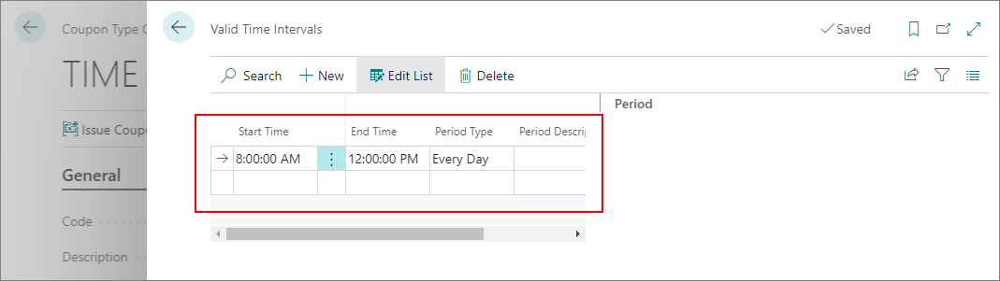

# Coupon troubleshooting

#### Is it possible to create multiple coupons that pertain to a single customer?       

Yes. After you've created a coupon and added the customer number in the **Customer No.** field, open the relevant **Coupon Type Card**, and activate the **Multi-Use Coupon** toggle switch. Then write the number of coupons you want to issue for the specific customer in the **Multi-Use Qty.** field. Note that multi-use coupons option is used for creating multiple coupons with the same number.    

     

#### Is it possible to add specific hours for coupon validity which will be checked when the coupon is scanned?

Yes. To enable time-based validation of coupons, follow the provided steps:
   1. Navigate to the **Coupon Type Card** of the coupon type you issued the coupons for. 
   2. Select **TIME** in the **Validate Coupon Module** dropdown list. 
   2. Click **Setup**, followed by **Setup Validate Coupon**.
   3. Insert the start time and end time for this coupon type in the **Valid Time Intervals** popup window.   

   

### Related link

- [Coupon types (Reference guide)](../retail/coupons/reference/coupon_types.md)