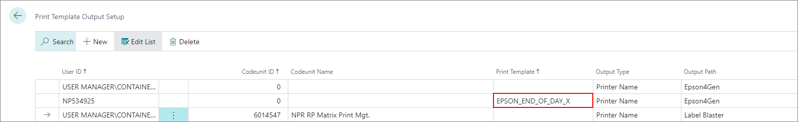

# Printer troubleshooting

#### The print job hasn't been sent to the printer. What can be done to fix this?

One of the following solutions should be applicable in this scenario:

- Navigate to the **Print Template Output Setup** administrative section, and check whether the **Codeunit Name**, **Codeunit ID**, and the **Output Type** are correctly stated. 

- Check if the codeunit has been tied to the print template list.

  

> [!Note]
> The drivers of all receipt and label printers should be **Generic/Text Only**.

- Check if the correct print template has been defined in the **Print Template List**.

> [!Note]
> If the Epson printer is used, it's not necessary to select a specific **Codeunit ID**, unless you're printing labels, in which case both the **Codeunit ID** and the **Print template** need to be specified regardless of the selected printer. 
