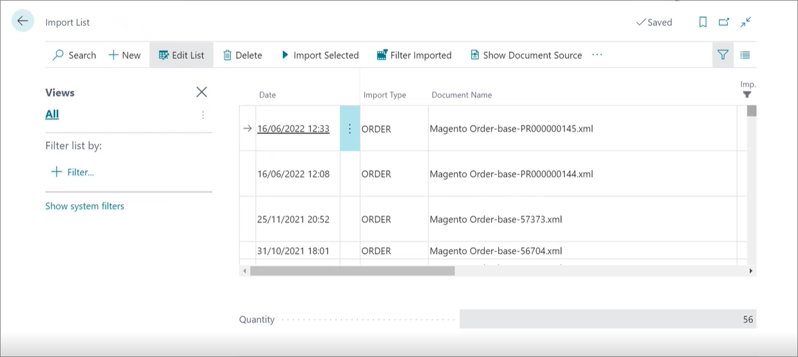

# Automatic sales order creation - Import list

Sales orders can be created automatically if imported from a web store. If you navigate to the **Import List** administrative section, you can see the list of all documents that were sent from the web store.

These documents can be referenced from sales order by adding the Magento order number to the **External Document No.** field in the **Sales Order** card. 

### Related links

- [Create a new sales order](../howto/create_sales_order.md)