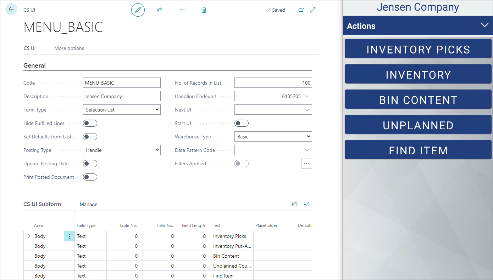
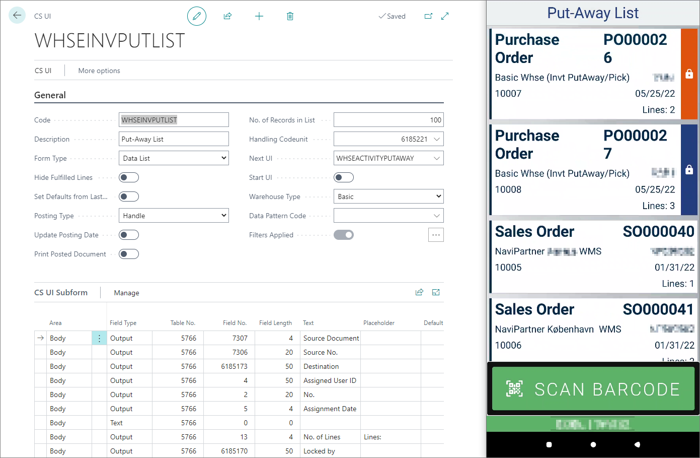
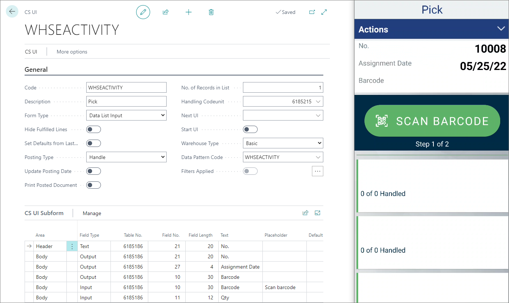

# Capture service UIs

The Capture Service user interfaces (CS UI) are used for defining the look and feel of WMS mobile device app. You can see the list of all available CS UIs in the **CS UIs** administrative section. It's also possible to edit the existing CS UIs or [create new ones](../howto/set-up-cs-uis.md). 

To see the current UI layout and hierarchy of UIs in the mobile app, navigate to the [**CS UI Structure**](./cs_ui_structure.md) administrative section. You can add or remove some segments from the current app layout if needed. 

> [!Note]
> There should be one **Start UI** for the company. By default, this is the login screen. You can pick the start UI either from the **CS UI Structure**, or an individual **CS UI** card.

## Form Type

There are several types of UIs in NP WMS. The three main ones are listed below. On the left side of each screenshot, you can see the setup in Business Central, and on left - the corresponding mobile app UI. To use one of these UI layouts in your app, apply the options presented in the Business Central segment of each screenshot. 

- **Card** (e.g. Login)     
  The **Card** type is used only for the Login screen, in which user input is required.

- **Selection List** (e.g. main menu)

    

- **Data List** (e.g. a list of locations, warehouse documents etc.)

    

- **Data List Input** (interactive UIs e.g. Warehouse Pick document)

    

> [!Note]
> NaviPartner provides standard UIs which can be implemented and modified as per requirements of the users.

## UI Subform

In the **UI Subform** section of each CS UI, you can create multiple areas each in-app page consists of. These areas can be: 

- The **Header** part which defines the title/purpose of an in-app page. 

> [!Note]
> In the **NP WMS** app you can click the header of each page to see which **UI Code**, **Handling Codeunit**, and **Next UI** were used. 

- The **Body** part which consists of options and fields available on an in-app page. 

- The **Footer**

## Data pattern code

Data pattern code is the code assigned to a certain product. It consists of some of the product's main characteristics, such as ingredients, year of production, expiration date, and so on. Each of these characteristics has its own ID, and the combination of all of them provides a unique ID for all goods which are placed inside the warehouse. 

## Handling codeunit

Each UI can be associated with one handling codeunit. Codeunits govern the back-end processes associated with each UI. 

### Related links

- [Set up UIs](../howto/set-up-cs-uis.md)
- [Set up Data Pattern Code](../howto/set-up-datapatterncode.md)
