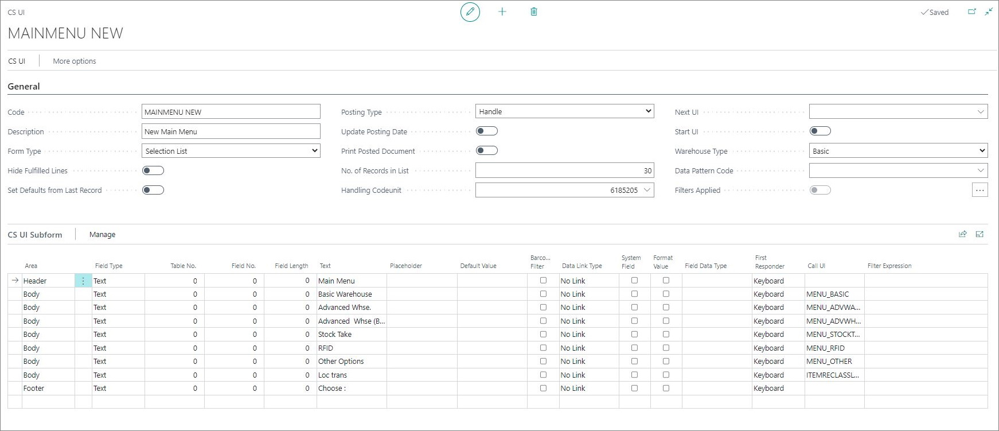
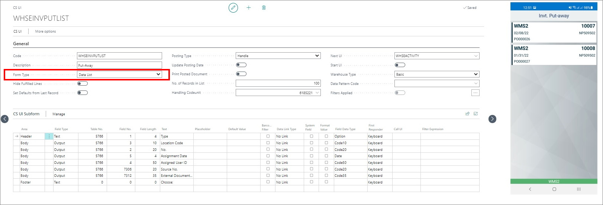
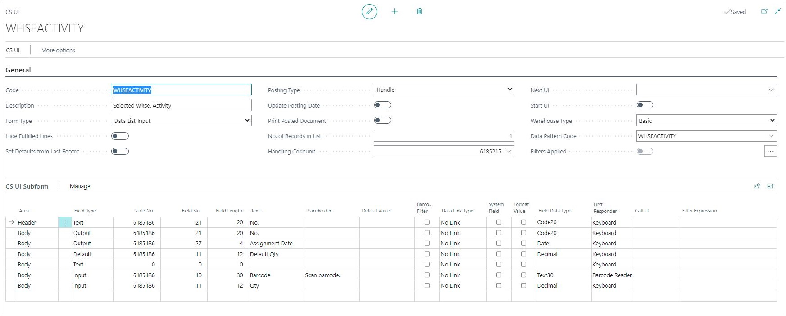

# Capture service UIs

The Capture Service user interface (CS UI) setup section is used for defining the user interface in the apps installed on mobile devices.

> [!Note]
> There should be one **Start UI** for the company. By default, this is the **LOGIN UI**.

There are mainly 3 types of UIs. To enable any of these types, apply the options indicated in the respective screenshots of the **CS UI** setup performed in BC.

- Menu (Selection List)

    

2. Data List (e.g. a list of locations, warehouse documents etc.)

    

3. Data Input (interactive UIs e.g. Warehouse Pick document)

    

A UI is made up of 3 sections:

- The header part which defines the type of UI

- The detail part which consists of fields to be displayed on the header part on the mobile device.

- The link to **Data Pattern Code** will defines the data displayed as lines on the mobile apps.

> [!Note]
> NaviPartner provides standard UIs which can be implemented and modified as per requirements of the users.

### Related links

- [Set up UIs](../howto/set-up-cs-uis.md)
- [Set up Data Pattern Code](../howto/set-up-datapatterncode.md)
