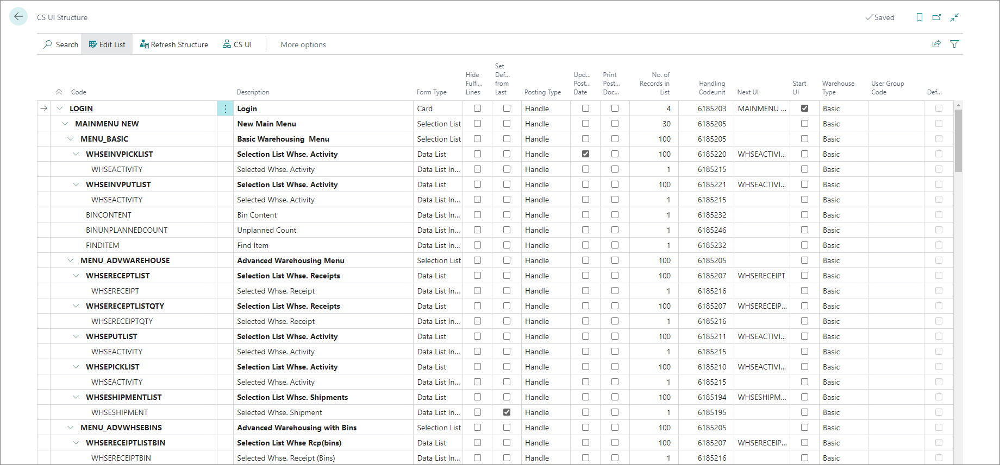
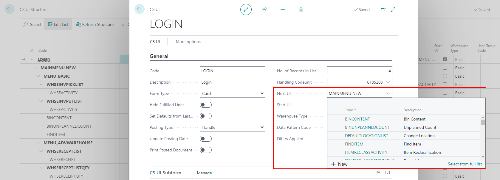

# CS UI structure

The **CS UI Structure** administrative section contains the current app layout and hierarchy of CS UIs organized in a single table. All changes you make here will be reflected in the menu of the mobile device.

> [!Note]
> From here, you can also modify the individual CS UI setup by selecting a CS UI code from the table, and then clicking **CS UI** in the ribbon. 

All CS UIs applied to the structure are interconnected via the **Next UI** fields which can be seen when modifying all of the CS UIs from the list.

If you create a new CS UI, and you wish to apply it to the structure, you can do so by adding its CS UI code to the **Next UI** field.

Likewise, if you wish to remove a certain CS UI from the structure, you can do so by deleting the value from the **Next UI** field, and then clicking **Refresh Structure** in the **CS UI Structure** ribbon to see the changes.

> [!Important]
> Be careful when removing parent CS UIs from the structure. Always check whether you need some of its children CS UIs first.

### Related links

- [CS UIs](cs-uis.md)
- [Set up CS UIs](../howto/set-up-cs-uis.md)
- [CS Setup](cs-setup.md)
- [CS printing](cs-printing.md)