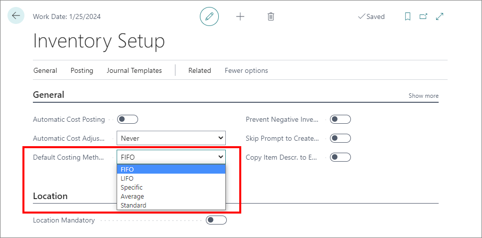
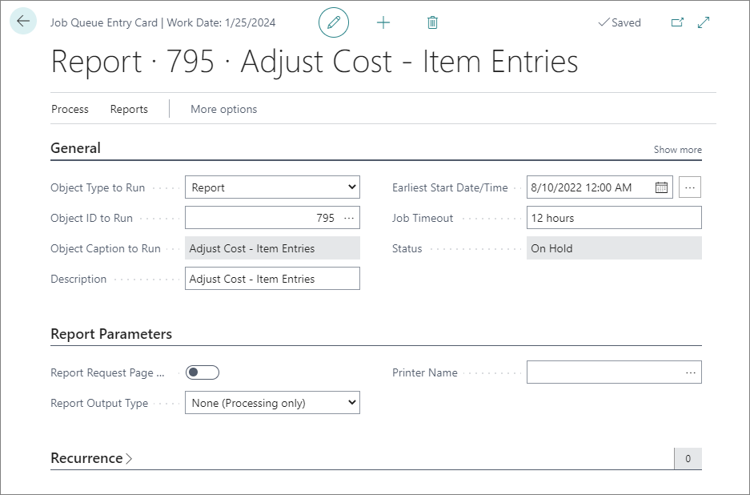
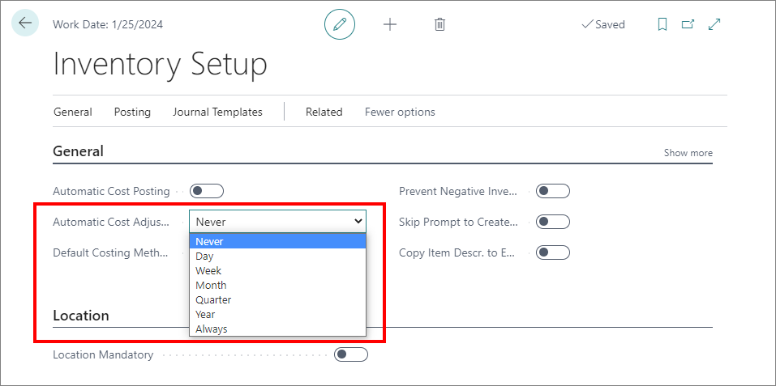

# Inventory costing methods

Different costing methods can cater to different business use cases in which you will be required to assign the unit cost differently. The default costing method selection is performed in the **Inventory Setup** administrative section of Business Central.

> [!Note]
> In the **Inventory Setup**, the costing method attached to the item is used by default. Different costing methods can be used for different items. Once selected, the costing method for an item can't be changed after the entries have been posted in the Item Ledger. You need to ensure that you've selected the correct costing method on the item itself before proceeding to the transaction posting for that item. 

## Specific

In the specific method, items are usually sold individually and serialized. To apply the specific costing method, you first need to specify the **Item Tracking Code**. Each item that is costed with the **Specific** method may have its unique price determined by its unique serial number. 

> [!Tip]
> The **Item Tracking Code** is defined in the **Item Tracking** section of the **Item Card**.

## FIFO

According to the FIFO (first in, first out) costing method that the first items placed in the inventory are sold before any other. It is best to use this costing method in the business landscapes in which the product cost is stable.

The cost of the oldest inventory is multiplied by the number of inventory items sold. 

## LIFO

For the LIFO (last in, first out) inventory costing method, a unit cost is the actual value of any receipt of the item. The items that were purchased most recently are sold first.

The cost of the most recent inventory is multiplied by the amount of inventory sold.

## Standard

In the standard costing method, regardless of the item stock purchase cost, the fixed standard cost will be used for all items. Due to the standard cost being fixed, the profit margin stays the same. It allows setting predetermined costs to inventory, and monitoring any differences which occur when using varieties. 

> [!Tip]
> The **Standard Cost** is defined in the **Cost & Posting** section of the **Item Card**.

When an adjustment entry is added to the **Item Journal** for a transaction which includes a standard cost, an error will be displayed if the **Unit Amount** contains a value that doesn't correspond to what you've defined in the **Item Card** for the **Standard Cost** of the item.

## Average

By default, the average costing method determines the inventory item cost based on the total cost of purchased goods, divided by the total number of items purchased. It requires setting up the period over which the average item price will be calculated as well as the average cost calculation type in the **Inventory Setup**. 

The **Average Cost Calculation Type** specifies how costs are calculated. 

| Average Cost Calculation Type Option      | Description |
| ----------- | ----------- |
| **Item**       | One average cost per item in the company is calculated for all locations.    |
| **Item & Location & Variant**   | An average cost per item for each location and variant of an item in the company is calcualted. The average cost of this item depends on where it's stored, and which variant is selected.       |

The **Average Cost Period** field determines the period over which a single average cost is calculated according to the quantity and value of all ins. The available options are **Day**, **Week**, **Month**, and **Accounting Period**.

You can view the detailed **Average Cost Calculation Overview** by clicking the **Unit Cost** value in the **Item Card** of your choice.

### Automatic cost adjustment

If **FIFO**, **LIFO** or **Average** costing methods are applied, the report for automatic cost adjustment needs to be run. It is used for readjusting the unit cost (if needed) after transactions are posted. To make sure all costs are up-to-date, it's recommended to schedule a recurring job which will adjust all modified cost each time it is automatically run. 

Jobs can be scheduled in the following ways:

- In the **Job Queue Entries**, you can select the **Adjust Cost - Item Entries** object to be run at the specified time and date (normally after working hours). You can also set up intervals for a recurring job, if you wish to run it multiple times.

> [!Note]
> If you select **Always**, the cost will be automatically adjusted each time you post an item ledger entry.

- In the **Inventory Setup** administrative section, you can set whether the automatic cost adjustments will be run, as well as the frequency of automatic cost adjustment jobs.

### Related links

- [Inventory adjustments](inventory_adjustments.md)
- [Revalue items (Item Revaluation Journal)](../howto/revaluation_journal.md)