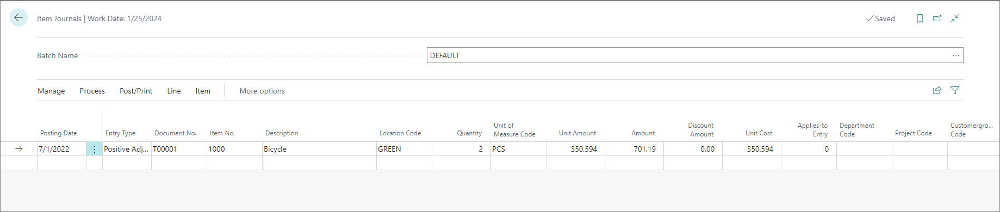
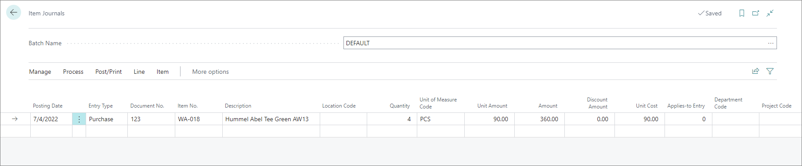
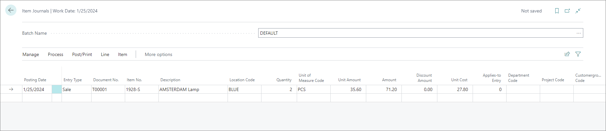

# Inventory adjustments

Inventory adjustments refer to all modifications of the stock level, which occur for various reasons. These can be results of sales, purchases, or positive and negative adjustments.

All inventory adjustments need to be recorded in the item journals.

## Item journals

Item journals are used for updating stock levels when they are increased or decreased. Each line you add to the **Item Journal** will state when and from where the items were purchased, sold, or subjected to positive or negative adjustments. 
  
- Positive adjustments refer to scenarios in which excess stock needs to be recorded and sold.     

- Negative adjustments refer to scenarios in which items are broken or otherwise deemed out of commission. Bear in mind that the value of the **Cost Amount (Actual)** on the posted negative adjustment may depend on the FIFO cost of the item batch.

> [!Note]
> When recording a positive or negative adjustment, the **Unit Amount**, **Amount**, **Discount Amount**, and the **Unit Cost** will be populated automatically. 

- Purchases are processes of procuring goods at a certain price. The **Purchase** entry type is used rarely in warehousing. Both purchases and positive adjustments indicate raise in the stock level, but this raise is recorded either in the purchase account or adjustment account respectively in the **General Posting Setup**. 

- Sales are processes of exchanging your goods for a certain amount of money. The **Sale** entry type is used rarely in warehousing. As soon as you provide the number of the item you wish to sell, as well as its quantity, the unit price of that item will be displayed in the **Unit Amount** field, and the full price for that quantity in the **Amount** field. The **Unit Cost** field will contain the amount at which the item was previously procured. 

Once you're done adding new journal entries, you can post them by clicking **Post/Print** in the ribbon, followed by **Post**. The posted entries will be displayed in the **Item Ledger Entries**. 

### Related links

- [Inventory and warehouse putaway](warehouse_putaway.md)
- [Inventory and warehouse pick](inventory_warehouse_pick.md)