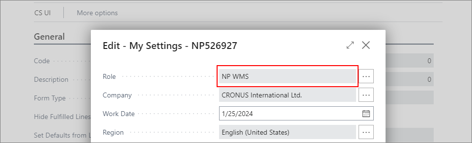
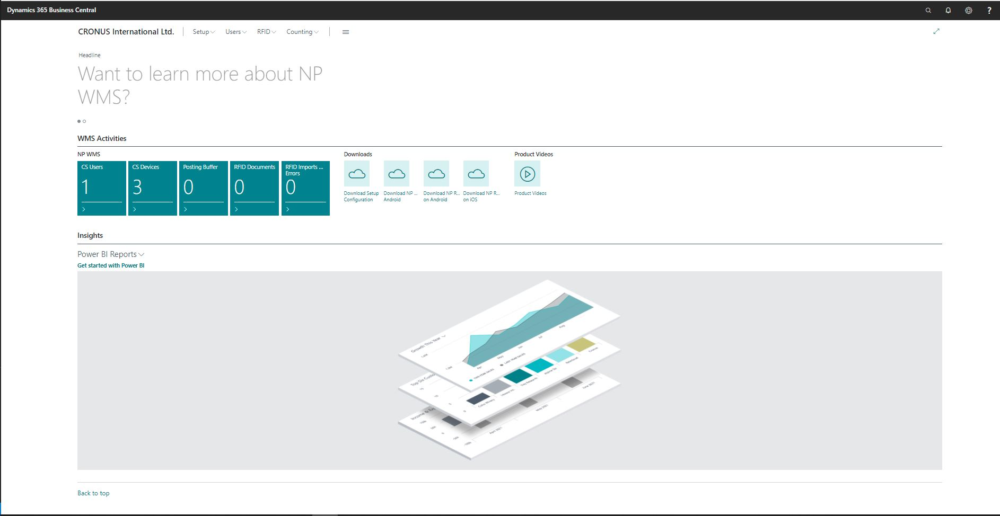

# NP WMS Role Center

Once the NP WMS extension is installed, you can navigate to the NP WMS role center by selecting the **NP WMS** role in Business Central's **My Settings** section. 

> [!Note]
> It is assumed that a BC database is already installed, and the required licenses purchased.

NP WMS Role Center is the main page for NP WMS Extension, from which you can access CS services and perform CS setup.

From this page you can access all the available setups for NP WMS, download the mobile apps, as well as the Test Data or Live (sample) templates.

### Related links

- [Fetch preset CS data](../howto/fetch-setup-data.md)
- [Set up CS users](../howto/set-up-cs-users.md)
- [Set up CS UIs](../howto/set-up-cs-uis.md)
- [Set up warehouse employees](../howto/set-up-warehouse-users.md)
- [Set up counting](../howto/set-up-counting.md)