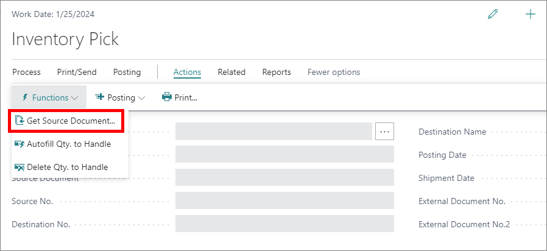

# Receive items at a warehouse location

Item reception is recorded in two different ways, depending on the current warehouse setup.

- If items arrive at a warehouse that hasn't previously been set up for warehouse processing, it's enough to record the receipt in the relevant document (e.g. purchase order).
- If the warehouse is set up for receipt processing, you need to retrieve the lines of the released source document that has triggered the lines' receipt. 

  > [!Note]
  > If there are bins in the warehouse setup, it's possible to receive items with the default bin, or select another bin to which items will be put away. After that, it's necessary to provide the item quantities received, and post the receipt to complete the process.

## Receive items with a document (e.g. purchase order)

To receive the items with the relevant document, follow the steps provided below. Purchase orders were used for an example of the said document. 

1. Click the  button, enter **Purchase Orders**, and choose the related link.      
2. Open a purchase order of your choice (or create a new one).      
   The **Purchase Order** card is displayed.
3. Enter the quantity of received items in the **Qty. to Receive** field.
4. Click **Post**.      
   The **Qty. Received** is updated as the result. 

## Receive items with a warehouse receipt

1. Click the  button, enter **Warehouse Receipts**, and choose the related link.      
2. Click **New**. 
3. Populate the necessary fields in the **General** tab.    
   - Make sure that the selected location has the **Require Receive** toggle switch enabled in its **Location Card** if you wish to use it in the warehouse receipt.     
   - The **Zone Code** and the **Bin Code** fields are automatically populated if the default zone and receipt bin are defined for the selected location.
4. Click the **Get Source Documents...** action in the ribbon.

    

5. Pick the released source document lines that define which items should be received, then click **OK**.       
   The source document lines are displayed in the **Lines** section.
6. Provide the adequate **Bin Code** per each line if bins are mandatory in the selected warehouse location, and if the **Bin Code** field in the **General** tab was populated.
7. Post the warehouse receipt via the **Posting** action in the ribbon.     
   You can choose whether you wish to only post the receipt, post and print it, or post and print with the put-away function.

### Related links

- [Inventory and warehouse putaway](../explanation/warehouse_putaway.md)
- [Location card (reference guide)](../reference/location_card.md)