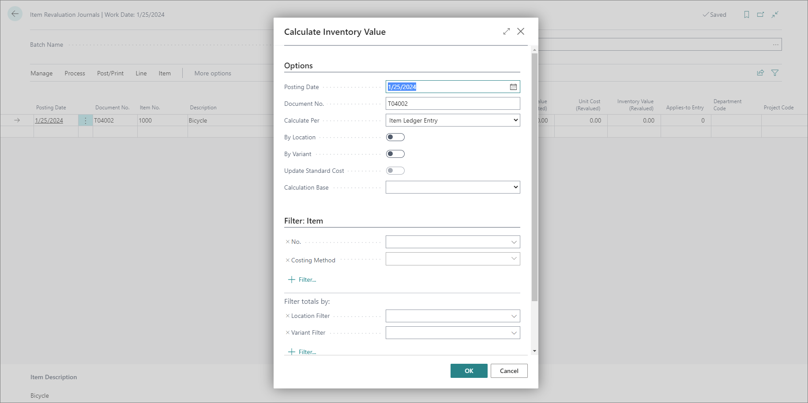

# Revalue items (Item Revaluation Journal)

The Item Revaluation Journal is used when you wish to change cost of items in the inventory. There are several instances in which it's necessary to perform inventory revaluation - for instance if you wish to revalue the remaining quantity of a certain item in inventory, or if you wish to check validity of a single decrease/increase in item costs. 

1. Click the  button, enter **Revaluation Journals** and choose the related link.        

> [!Note]
> Make sure that all items are adjusted via the **Adjust Cost - Item Entries** action before you start revaluing them. 

1. Click **Process** in the ribbon, and then **Calculate Inventory Value**.    
   The **Calculate Inventory Value** popup is displayed.

3. Once you've set up the calculation parameters according to your business needs, click **OK**.    
   All **Open** entries from the Item Ledger are now added in this Revaluation Journal.
   
   > [!Note]
   > Bear in mind that the **Average Costing Method** isn't compatible with the calculations per **Item Ledger Entry**.

4. In the **Unit Cost (Revalued)** field, enter the new unit cost or enter the new total amount in the **Inventory Value (Revalued)** field.
   The relevant fields in the journal are updated automatically. The **Amount** field shows the difference between the **Inventory Value (Calculated)** and the **Inventory Value (Revalued)** field.

5. When you're done with the revaluation, click **Post/Print** from the ribbon, followed by **Post**.      
   Once the revaluation journal entries are posted, you can see that the **Unit Cost** value has been changed in the relevant **Item Card**.

### Related links

- [Reclassify items (Item reclassification journal)](reclassify_items.md)
- [Post inventory adjustments (Item Journal)](post_inventory_adjustment_item_journal.md)