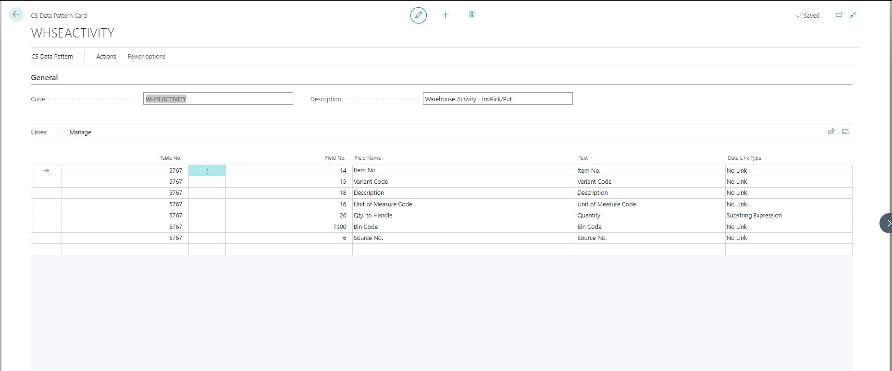

# Set up CS Data Patterns

A data pattern defines the way in which the data collected can be structured, indexed, and made available for searching. 

To set up data patterns, follow the provided steps.

1. Click the  button, enter **CS Data Patterns** and choose the related link.        

A list of configured Data Patterns is displayed.              
 
2. Click **New**.

3. Fill out the necessary fields as presented in the provided screenshot.     
   

| Field Name      | Description |
| ----------- | ----------- |
| **Code**   | Specifies a unique code for the CS data pattern.     |
| **Description**   | Specifies the description of the CS data pattern.      |
| **SubForm**  | Enter the fields you would like to display as lines on the mobile device in the subform area. |

All changes are saved automatically. 