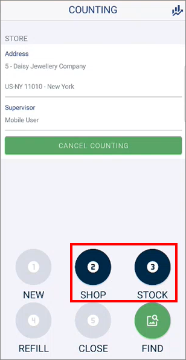
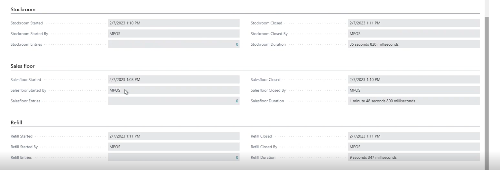

# Perform shop and stock count

Radio Frequency Identification (RFID) is a system that transmits identity in the form of a unique serial number of a product wirelessly. It is used to identify objects, collect data about them, and enter those data directly into computer systems with little or no human intervention. While barcodes are cheaper and well-established globally, the RFID scanning is quicker since it can scan multiple items simultaneously. 

The NP RFID app is used for optimizing the inventory management across different locations. From the app, you can perform counting of the stock and shop inventory, configure and track shipping, and perform tag handling. This article focuses on the shop and stock count, along with the refill functionality. 

> [!Note]
> The NP RFID app is Android-exclusive.

## Prerequisites for using the NP RFID features

- Download and install the [WMS extension for Business Central](Install-NP-WMS.md), and perform the necessary authentication with [the QR code scan](create-qr-codes.md).
- Download and install the [NP RFID app](../howto/install-mobile-apps.md).
- Perform the necessary [initial setup for the RFID functionalities](rfid_setup.md). 

## Counting - common steps

Counting is the most commonly used feature in the mobile app. Follow the provided steps to go through the entire counting procedure:

1. Press **COUNT** in the NP RFID welcome screen to open the counting interface. 
2. Locate the shop/warehouse you want to perform the counting in by pressing **FIND**.      
   This store corresponds to the **Location** entity in Business Central. 
3. Press **NEW** to start creating an inventory calculation.          
   You can also schedule when an inventory calculation should be performed from the back end.
4. Move on to either **SHOP** or **STOCK** count steps.      

   

## Shop count

1. Press **SHOP**.      
   You will see the predicted number of items that should be found in the shop during the count, as well as the inventory sorted according to the item category.     
   
2. Press **START** to initiate the count, and then use the scanner to count the items.    
   You can see how many tags have been counted so far, as well as the progress of the entire counting process in the upper part of the screen. The percentage bar indicates to which degree the predicted and the actual inventory match. 
   - The dark-blue numbers represent the inventory predicted in Business Central.
   - The green numbers represent the counted inventory.
   - The red numbers represent discrepancies between the predicted and the counted inventories. 

    > [!Note]
    > By clicking the item, you can see which specific unit is missing, and see its picture.

3. You can then either **RESET** the count, or **SAVE** it.     
   After you're done with the shop count, you can move on to the **STOCK** count.

> [!Note]
> It is possible to find unexpected item tags during the counting. You can import these items into Business Central after the count is completed. 

### Stock counting procedure

1. Press **STOCK**.     
   You can see the predicted number of items that should be found in the stock room, as well as the inventory sorted according to type of items it consists of. If some items that are missing from the shop need to be restocked, and these items can be found in the stock room, it's possible to transfer them via the **REFILL** functionality. 
2. Press **START** to initiate the count, and then use the scanner to count the items.    
   You can see how many tags have been counted so far, as well as the progress of the entire counting process in the upper part of the screen. The percentage bar indicates to which degree the predicted and the actual inventory match. 
   - The dark-blue numbers represent the inventory predicted in Business Central.
   - The green numbers represent the counted inventory.
   - The red numbers represent discrepancies between the predicted and the counted inventories. 
3. You can then either **RESET** the counting process, or **SAVE** it.    
   After you're done with the counting in the stock room, and there are items that you wish to transfer to shops, you can move on to the **REFILL** section.      
   If there are no items that you can refill the shop inventory with, skip the **REFILL**, and **CLOSE** the counting. 

### Refill procedure

1. Press **REFILL**.    
   You will see the suggested list of items that can be restocked in the shops. 

   

2. Select the items you wish to refill the shop stock with by enabling the toggle switches next to respective items. 
3. Press **SAVE**.
4. Move on to the **CLOSE** section to review the refill items. 
5. Press **SAVE** again.    
   Once the counting is approved, the process is completed. 

> [!Note]
> You can also access the **Deviation Journals** from the button in the upper-right corner of the **COUNTING** page to see the history of all performed countings, so you can compare them if needed. You can also see this data in the **CS Stock Takes List** in Business Central. 

### Business Central portion

Whenever shop or stock count is performed, certain actions need to be taken in Business Central as well. 

- In the relevant **CS Stock-Takes Card** reached via the **Countings** administrative section, you can see whether the sales floor or the stock room have been scanned, how long the scan took, as well as other related information. Each line corresponds to a single unit of the specific item.    

   

- In the **Refill** section you can specify which items you're going to move from the stockroom to the sales floor.
- Any changes in the stock that have been located while counting need to be posted in the [**Physical Inventory Journal**](https://learn.microsoft.com/en-us/dynamics365/business-central/inventory-how-count-adjust-reclassify). Once the stock count is finished, it will be closed, and the **Journal Posted** checkbox will be ticked.

> [!Video https://share.synthesia.io/e40343b3-3ccd-489e-812e-c2ae88422ff4]

> [!Video https://share.synthesia.io/3ddb5ff5-5fe0-4b83-adab-0862d81076f7]

### Related links

- [Install WMS and RFID apps on mobile devices](install-mobile-apps.md)
- [Create a CS RFID tag model](create_rfid_tag_model.md)