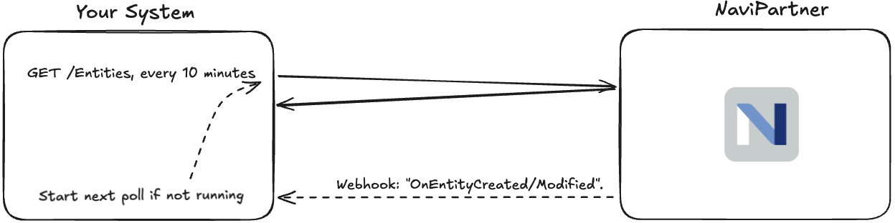
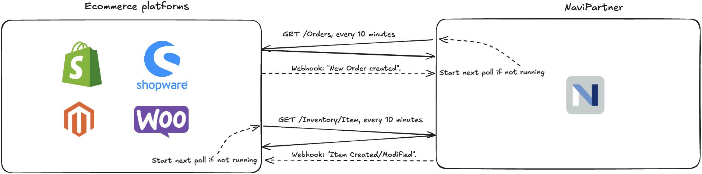

The term replication refers to copying data from our system to yours while only transferring what has changed. Think of it like keeping your local database synchronized with ours.

## How Replication Works

All endpoints that support pagination also support replication. When you add `sync=true` to your request:

- Results are sorted by `rowVersion` (a unique identifier that increases with each change)
- Every record includes its `rowVersion` value
- The system ensures consistency and performance through proper database isolation & indexing.
- You can tell us the last `rowVersion` you received & processed when you do consecutive polls, so we only send newer changes

## Replication Query Parameters

| Parameter        | Type    | Description                                                    |
| ---------------- | ------- | -------------------------------------------------------------- |
| `sync`           | boolean | Set to `true` to enable replication mode                       |
| `lastRowVersion` | string  | The highest `rowVersion` you received in your previous request |

## Response Properties

| Property     | Type   | Description                                 |
| ------------ | ------ | ------------------------------------------- |
| `rowVersion` | string | A unique version identifier for each record |

## Step-by-Step Guide

1. Make your first request with `sync=true`
2. Process each page of data, while storing the highest `rowVersion` value you process.
3. In your future polls, include the highest `rowVersion` as the `lastRowVersion` parameter
4. Repeat - you'll only receive records that were created or modified since your last request.

<Warning>
  When synchronizing data, always use the same unique identifier that we use (if
  in doubt, use our UUID "id" field) to avoid creating duplicates in your system
  if you re-run synchronization.
</Warning>

## Poll versus push

While many integrations are push-based with out a polling mechanism, there are many reasons to always start with a polling based integration approach.

### 1. Simpler Architecture

- Each system is responsible for its own synchronization. This is especially important if you have many subscribers to the central changes.
- The central system doesn't need to track the status of multiple clients.
- The central system does not hold API credentials to all clients.

### 2. Better Error Recovery

- If your system goes offline or becomes temporarily unresponsive, it simply polls for all missed updates when it is ready again.
- No risk of permanently losing data due to failed push attempts batching up queued data across days, weeks, months in the central node.
- Your system always knows exactly what data it has already processed, the central node does not need to keep track of it.

### 3. Addressing "Real-Time" Requirements

A "near real time" requirement is what typically pushes (pun intended) people towards a push driven approach instead of a poll driven one.  
However, you still have options:

- **Option 1:** Poll frequently (every 1-10 minutes), which is sufficient for most use cases
- **Option 2:** Implement webhooks as "notifications" alongside polling:
  - Our system sends a simple notification when data changes
  - Your system initiates an immediate poll after receiving the notification, instead of waiting for the next scheduled interval.
  - You maintain the reliability of polling while achieving near real-time updates

## Polling with Webhooks: Best of Both Worlds

A basic implementation looks like this:

In this example:

- Your system polls NaviPartner every 10 minutes for changes
- NaviPartner sends a webhook event to your system when changes occur
- Your system can choose to poll immediately after receiving the event.

The critical detail here is that the entire webhook flow (the dashed lines) is optional.  
If you're system is under heavy load you can also skip it and let your next timed poll handle it. Or only implement webhooks for the most critical entities.

## Bi-Directional Polling Example

Remember that the poll+webhook best practices approach applies in both directions.
Below, you see a simplified integration example between NaviPartner and an ecommerce platform. It is not always possible to follow the best practices due to platform limitations, but it is always worth knowing them.

In this example:

- NaviPartner polls the external platform for new orders
- The external platform polls us for product & inventory updates
- Webhooks are used to optionally speed up the sync in both directions.
- Each system remains the "source of truth" for its own data

<Info>
  This approach will cover inserts and modifications but not deletions. Tracking
  deletions is beyond the scope of this article, but the simplest approach would
  be to periodically resync everything and delete data you did not receive.
</Info>
